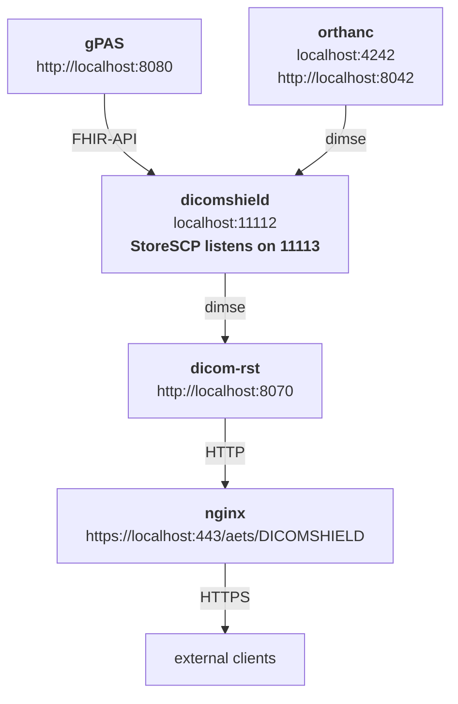
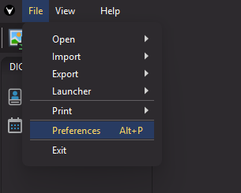
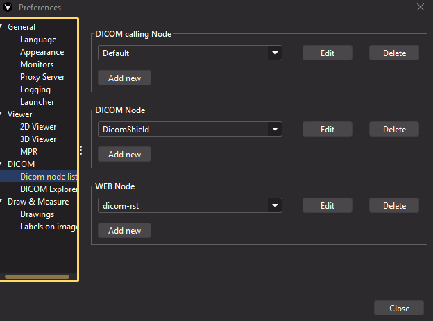
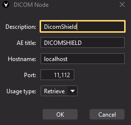
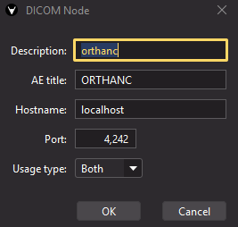
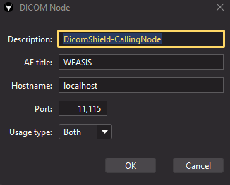
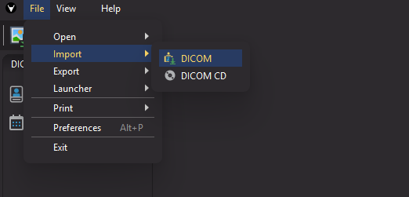
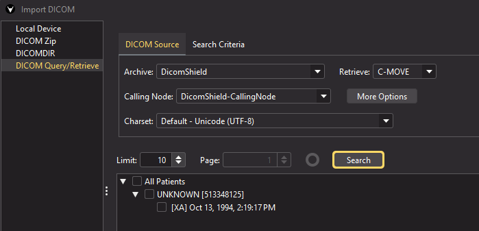

# DicomShield

DicomShield is a reverse proxy for DICOM C-FIND and C-MOVE operations. It protects the privacy of the patients in DICOM 
by replacing the IDs by pseudonyms using an pseudonymization service like gPAS on the fly. 

## Installation

Clone this repository, check that Docker is installed on your system. 
The docker-compose.yml will create the Docker container as follows:

It is important to note at this point that most DICOM applications require you to register the IPs and ports to the
corresponding components in their config. 
Keep in mind that you can access them by name inside the container network, but you need `host.docker.internal` 
if you want to connect from inside a container to the host, and use port-forwarding and `localhost` to connect to inside 
the container. 

### Create certificates under 'DicomShield/certs'
#### Step 1: Create a root Certificate Authority
    openssl genrsa -out rootCA.key 2048
    openssl req -x509 -new -nodes -key rootCA.key -sha256 -days 1024 -out rootCA.pem

#### Step 2: Generate server certificate for PACS
    openssl genrsa -out pacs.key 2048
    openssl req -new -key pacs.key -out pacs.csr 
    openssl x509 -req -in pacs.csr -CA rootCA.pem -CAkey rootCA.key -CAcreateserial -out pacs.crt -days 500 -sha256

#### Step 3: Generate client certificate for DICOM anonymizer
    openssl genrsa -out client.key 2048
    openssl req -new -key client.key -out client.csr
    openssl x509 -req -in client.csr -CA rootCA.pem -CAkey rootCA.key -CAcreateserial -out client.crt -days 500 -sha256

## Setup dicomshield config
Open `proxy/configs/config.yml`. You need to configure:
1. the upstream server 
2. the DICOM clients that may access DicomShield (⚠️all clients must be registered here with AET + IP + Port ⚠️)
3. the pseudonymization server that should be used (preferably gPAS)

## Setup dicom-rst config
[DICOM-RST](https://github.com/UMEssen/DICOM-RST) is used to convert DIMSE requests into DICOMweb. 
DICOM-RST uses C-MOVE to retrieve data. C-MOVE means that application A tells application B that it should 
send application C some data using C-STORE. Therefore, DicomShield must act as its own STORE-SCP and forward the data. 
Place make sure the correct AET of DicomShield is set, to pseudonymize `C-STORE` request triggered by `C-MOVE`

    dimse:
        - aet: DICOMSHIELD-SCP
        interface: 0.0.0.0
        port: 7001
        uncompressed: true

## Setup gPAS

Download [gPAS](https://www.ths-greifswald.de/forscher/gpas/) Docker container. Add permissions:

    sudo chmod -R 755 compose-wildfly/
    chown -R 1111:1111 compose-wildfly/logs/ compose-wildfly/deployments/

Startup gPAS, open web UI (http://localhost:8080/gpas-web/), and create the domain "DicomShield".

## Weasis setup
We recommend  [Weasis](https://weasis.org/en/) for testing. After installation, you have to configure the DICOM endpoints 
in the settings:

Below "DICOM node", click "Add new"

Optionally, if you want to put images on the orthanc PACS, you can also configure it here. *Otherwise, we recommend to use the 
web interface of orthanc (runs by default at http://localhost:8042) to upload some test data.*

For the receival of images via C-MOVE, you need to set up the calling node. 

The same settings must be configured in `config.yml` of DicomShield (ALLOWED_AETS)!

Now, you can use the import function of Weasis to search your DicomShield!

## Examples URLs of DICOMweb

* http://localhost:8070/aets/DICOMSHIELD/studies/
* http://localhost:8070/aets/DICOMSHIELD/studies/{STUDY_ID}/series/{SERIES_ID}

## Tested with 
DicomShield has been tested with the following clients:
* [Weasis](https://weasis.org/en/)
* [MicroDicom](https://www.microdicom.com/)
* [Ginkgo CADx](https://github.com/gerddie/ginkgocadx)

and the following servers: 
* [orthanc](https://www.orthanc-server.com/)  
  * An example config is included in the container (orthanc.json)
* [dicoogle](https://dicoogle.com/) 
  * replace `<move-destinations />` in server.xml with `<move-destinations><move-destination aetitle="DICOMSHIELD-PACS" address="localhost" port="11113" public="true"
                              description="DicomShields C-STORE endpoint"/></move-destinations>`
  * Note: [C-GET seems to be not supported by dicoogle](https://github.com/dicoogle/dicoogle/issues/393)